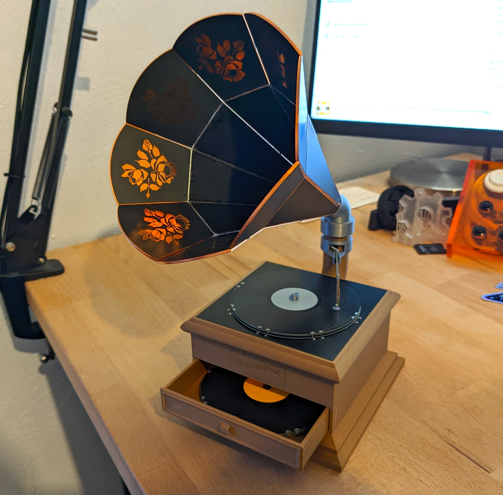

# Voltavox
Voltavox is a PCB-based phonograph "badge"!

Made primarially from PCBs, you can take a tiny PCB record, place it on the platter, place the needle on the record, and a song begins to play! Put a different record on, and as expected, you'll get a different song.

Voltavox is based heavily on the [Adafruit Audio FX Sound Board](https://www.adafruit.com/product/2217). Using [arturo182](https://github.com/arturo182)'s [FlexyPins](https://lectronz.com/products/flexypin-pack-of-100) and some castellated edges on the record PCBs, each record selectively pulls a different control pin on the Audio FX board to ground, choosing a different track. Dropping the needle onto the record completes the circuit and starts playing the audio. 
The horn is also comprised of PCBs soldered edge-to-edge, with a small speaker inside.

## BOM
### Off The Shelf
| Item | Quantity |
| ---- | -------- |
| [Adafruit Audio FX Sound Board + 2x2W Amp - 16MB](https://www.adafruit.com/product/2217) | 1 |
| [8 Ohm Speaker](https://www.adafruit.com/product/1890) | 1 |
| [1200mAh LiPo Battery](https://www.adafruit.com/product/258) | 1 |
| [Micro-Lipo Charger](https://www.adafruit.com/product/1904) | 1 |
| [FlexyPins](https://lectronz.com/products/flexypin-pack-of-100) | 10 |
| [SPST Slide Switch](https://www.adafruit.com/product/805) | 1 |
| [Silicone Wire - 30AWG](https://www.adafruit.com/product/3169) | 1 |
| [P75-LM3 Spring Pin](https://www.adafruit.com/product/394) | 1 |
| [1x14 2.54mm SMT Header](https://www.digikey.com/en/products/detail/w%C3%BCrth-elektronik/61001418221/4846817) | 2 |
| [1x4 2.54mm SMT Header](https://www.digikey.com/en/products/detail/metz-connect-usa-inc/PM20204VBNN/12342877) | 1 |
| [Adhesive-Backed Green Felt](https://amzn.to/3xrK0NY) | 1 |
| [Dark Wood PLA Filament](https://amzn.to/3QOZQca) | 1 |
| [Record Label Stickers](https://www.amazon.com/dp/B06VX94JD8)| 1 |

### PCBs
| Item | Quantity | Order Instructions | Note |
| ---- | -------- | ------------------ | ---- |
| Record | 1+ | 1.6mm PCB, 1oz copper. Gloss Black Soldermask, Lead-Free HASL finish. | Has castellated pads to interface with the FlexyPins. Be sure to include a note to your board shop. | 
| Platter | 1 | 1.6mm PCB, 1oz copper. Matte Black Soldermask, Lead-Free HASL finish. | - |
| Needle | 1 | 1.6mm PCB, 1oz copper. Gloss Black Soldermask, Lead-Free HASL finish. | - |
| Horn Tier 1 | 8 | 1.6mm PCB, 1oz copper. Matte Black Soldermask, ENIG gold immersion finish. | Has castellated edges that are used for structural soldering. Be sure to include a note to your board shop.|
| Horn Tier 2 | 8 | 1.6mm PCB, 1oz copper. Matte Black Soldermask, ENIG gold immersion finish. | Has castellated edges that are used for structural soldering. Be sure to include a note to your board shop.|

### 3D Prints
| Item | Quantity | Material | Note |
| ---- | -------- | -------- | ---- |
| base | 1 | Wood PLA | Print without supports at 0.2mm layer height, 15% infill or more |
| horn-base-adapter | 1 | Silver PLA | Print with supports at 0.2mm layer height, 20% infill or more |
| drawer | 1 | Wood PLA | Print without supports at 0.2mm layer height, 15% infill or more |
| needle-mount | 1 | PETG | Print without supports at 0.2mm layer height, 20% infill or more |

